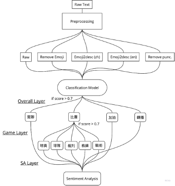

# Topic-Modeling-for-TVL-livestream-comments

## Abstract
這是一份和企業甲級排球聯賽（以下簡稱企排）合作的研究，旨在為企排 YouTube  直播留言建立一個主題模型以量化分析觀眾的討論話題，進而達到了解各主題隨時間的熱度 分佈及掌握觀眾的注意力，以利後續開發更多的商業用途。本文所使用的所有資料均源自於 企排 18 年所有直播場次的留言資料，資料分別透過五個預處理方式以評估模型表現。分類 模型由三個分類器所構成，分別用來分類主要主題（閒聊、比賽、加油、轉播，以下稱為 Overall Layer）、次要主題（將比賽細分為球員、球隊、裁判、教練、戰術，以下稱為 Game Layer）以及情緒分析（以下稱為 SA Layer），三者的量化評估分數 Area Under ROC Curve 高達 99.55 / 99.73 / 99.99，單句留言平均計算時間（計算於 Nvidia T4 GPU）為 0.044  seconds / sentence。 

## Data Preprocessing
流程如 Fig. 1 所示，一段文字進入到系統後會先進行文字前處理的部分，在前處理的 過程會先將 UTF-8 decoder 不可譯的 Unicode strings 先移除，再將空值、標記的 @ 和超連結移除，最後將所有英文改為小寫。不做太多傳統的前處理步驟是參考了文獻[1, 2]中顯示 BERT 在沒有任何前處理的情況下表現最佳（勝過 mentions removal, retweet tags removal, hashtags removal, URLs removal, and punctuation removal），且 punctuation removal 的表現會最差，但我也在這次研究復刻了這個實驗以驗證這個現象是否也適用在這份資料當中。故在資料前處理的部分（不同於前面的文字前處理），我將資料分為五組以做驗證，分別是

1. 不做任何處理的 Raw data（以下簡稱 raw）
2. 將 Emoji 移除的 Remove Emoji（以下簡稱 rmemoji）
3. & 4. 將 Emoji 利用 Python 的 Emoji package 轉為文字敘述的 Emoji to description，其中 又可分為中英文版（以下簡稱 emoji2desc_zh & emoji2desc_en） 
5. 將標點符號等移除（只留文字本身）的 Remove punctuation（以下簡稱 rmpunc）

在 Emoji 處理的部分我參考了兩篇文獻及研究報告 [3, 4]，文獻中成功展示了經過 emoji2desc 後的表現更為出色，故綜合以上，我預期的 Evaluation score 由高到低分別是 emoji2desc_zh ≈ emoji2desc_en > raw > rmemoji > rmpunc，但最終結果顯示為 (F1 score) rmemoji (0.9789) > raw (0.9728) > emoji2desc_zh (0.9721) > emoji2desc_en (0.9629) > rmpunc  (0.9561)，這部分的詳細原因會留待 Error Analysis 時再來討論。

