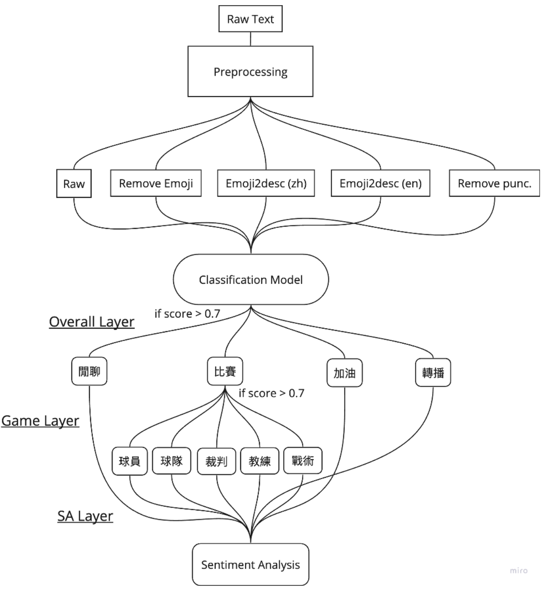

# Topic-Modeling-for-TVL-livestream-comments

## Abstract
這是一份和企業甲級排球聯賽（以下簡稱企排）合作的研究，旨在為企排 YouTube  直播留言建立一個主題模型以量化分析觀眾的討論話題，進而達到了解各主題隨時間的熱度 分佈及掌握觀眾的注意力，以利後續開發更多的商業用途。本文所使用的所有資料均源自於 企排 18 年所有直播場次的留言資料，資料分別透過五個預處理方式以評估模型表現。分類 模型由三個分類器所構成，分別用來分類主要主題（閒聊、比賽、加油、轉播，以下稱為 Overall Layer）、次要主題（將比賽細分為球員、球隊、裁判、教練、戰術，以下稱為 Game Layer）以及情緒分析（以下稱為 SA Layer），三者的量化評估分數 Area Under ROC Curve 高達 99.55 / 99.73 / 99.99，單句留言平均計算時間（計算於 Nvidia T4 GPU）為 0.044  seconds / sentence。 

## Data Preprocessing
流程如 Fig. 1 所示，一段文字進入到系統後會先進行文字前處理的部分，在前處理的 過程會先將 UTF-8 decoder 不可譯的 Unicode strings 先移除，再將空值、標記的 @ 和超連結移除，最後將所有英文改為小寫。不做太多傳統的前處理步驟是參考了文獻[1, 2]中顯示 BERT 在沒有任何前處理的情況下表現最佳（勝過 mentions removal, retweet tags removal, hashtags removal, URLs removal, and punctuation removal），且 punctuation removal 的表現會最差，但我也在這次研究復刻了這個實驗以驗證這個現象是否也適用在這份資料當中。故在資料前處理的部分（不同於前面的文字前處理），我將資料分為五組以做驗證，分別是

1. 不做任何處理的 Raw data（以下簡稱 raw）
2. 將 Emoji 移除的 Remove Emoji（以下簡稱 rmemoji）
3. & 4. 將 Emoji 利用 Python 的 Emoji package 轉為文字敘述的 Emoji to description，其中 又可分為中英文版（以下簡稱 emoji2desc_zh & emoji2desc_en） 
5. 將標點符號等移除（只留文字本身）的 Remove punctuation（以下簡稱 rmpunc）

在 Emoji 處理的部分我參考了兩篇文獻及研究報告 [3, 4]，文獻中成功展示了經過 emoji2desc 後的表現更為出色，故綜合以上，我預期的 Evaluation score 由高到低分別是 emoji2desc_zh ≈ emoji2desc_en > raw > rmemoji > rmpunc，但最終結果顯示為 (F1 score) rmemoji (0.9789) > raw (0.9728) > emoji2desc_zh (0.9721) > emoji2desc_en (0.9629) > rmpunc  (0.9561)，這部分的詳細原因會留待 Error Analysis 時再來討論。

## Preparing the training data
在訓練資料的準備上大致可以分為兩種方法，分別為 Overall & Game Layer 使用的 Word2Vec model 標記和 SA Layer 使用的 pseudo-labeled training set。在 Overall & Game Layer 的部分，我參考了文獻中為 Multi-label classification 標記資料的方法 [5]，為企排訓練了一個專屬的 Word2Vec model，訓練資料包括 

1. 這次使用的所有留言
2. 球隊名稱  
3. 球員名稱和綽號 
4. 企排官方新聞逐字稿

並比較了三種形式的資料集 
(a) 只含有留言資料  
(b) 留言資料 groupby sentence（一句留言視為一個資料）+ 新聞逐字稿 
(c) 留言資料 groupby game（一場比賽的留言視為一個資料）+ 新聞逐字稿

以球員綽號 “卡拉”為例，可以發現在 (a) 只含有留言資料的模型含有較多的雜訊，在 (b) 留言資料 groupby sentence + 新聞逐字稿和 (c) 留言資料 groupby game + 新聞逐字稿均能較準確的辨認出其他球員名稱及綽號，但在 (c) 組整體分數較低，故最後選擇使用 (b) 組資料作為 Word2Vec model 訓練資料。 

在 Word2Vec model 準備完成後即可利用 Keywords 來標記訓練資料，Keywords 包括
- 代表各隊的 Emoji
- 和各主題有高相關性的詞和 Emoji
  - Emoji for 加油 
    - ⛽ 🏆 🎉 🦾 💯 🙏 🔥 🫶 …
  - Keyword for 加油
    - [
'加油',
'最棒','穩住','撐住','軋油','+u','催蕊','好球','777','666','感動','衝啊','送啦' … ]
  - Keyword for 教練
    - [
'小牛','鄧公','教練','教练','大康','康胖','舟','恩崇','名鋒','顯丞','惠方','k總' … ]
  - Keyword for 轉播
    - [
'小編','球評','主播','聊天室','畫面','亞理,'卡卡','雜訊','運鏡','鏡位','延遲','破萬','比數'
… ]
- Domain knowledge
- 若不包含任何已標記的 keywords 則歸類在「閒聊」

標記後的各主題資料量如 Table 2 所示，可以看到球迷談論的話題主要集中在「加油」、「閒聊」、「球員」、「球隊」，次要話題如「轉播」、「教練」、「裁判」、「戰術」則較少球迷談論。

在 SA Layer 的部分，我利用並微調了 self-training 中 pseudo-labeled training set 的概念 [6]，利用 Hugging Face 平台上三個按讚和下載數最高的中文情緒分析模型，分別為

- lxyuandistilbert-base-multilingual-cased-sentiments-student
- IDEA-CCNL/Erlangshen-Roberta-330M-Sentiment [7]
- MoritzLaurer/mDeBERTa-v3-base-mnli-xnli [8]

利用這三個模型來標注資料，類別為 Positive / Negative / Neutral，標注步驟如下

1. 利用預訓練模型對資料集做分類，會得到三組的預測和信心分數
(只記錄分數高於 0.5 的預測)
](<pseudo-labeled training set by 3 pre-trained model.png>)

2. 若三組預測結果均相同，則相信該預測正確，如 index 4, 7, 12...
3. 取所有預測結果相同的，將信心分數取平均後由高到低排列並個別設立信心門檻

4. 最後取的訓練資料量和信心門檻如下，為了使模型不產生 bias，在 Positive 和 Negative 取的資料量相同，各取 2000 筆資料，信心門檻均高於 0.91，在 Neutral 的資料量較少，故只取了 150 筆資料並將信心門檻設在約 0.75，目的是在資料量及品質之間取一個平衡

## Training
相較於傳統的 LDA Topic modeling 分群 (clustering) 的想法，其運用的 Bag of words 概念較適用於在長文本、純機率分布且無上下文觀念，而 Hugging Face 平台上也有多個預訓練的中文主題分類模型，之所以沒有直接採用並作微調的原因是大部分的訓練集都是非常長的文本，且文本內容和主題取向也和企排留言相去甚遠。故我認為用參數量更大、運用 Transformer 架構且未經大量微調的 BERT-base-Chinese model [9] 來做 Text multi-label
classification 更適合企排留言較短、主題發散的資料型態。設定參數如下

### Training Process

## Result & Discussion

### Training Result

.png>)

### Performance

#### Overall Layer

#### Game Layer

#### Sentiment Analysis Layer

下圖 (Fig. 5) 是將所有話題加總計算的熱度分數隨比賽時間變化曲線，記錄的是2023 年 3 月 25 日進行的企排 18 年總冠軍賽，由連莊排球隊出戰屏東台電男排。以藍色和灰色區分比賽期間和休息準備時間，數據顯示在比賽期間的熱度是整體高於休息時間，其中在一、二、三局比賽期間都可以看到在每局中段的時候聊天熱度相對開局和局末有一段低點，表示此時觀眾的注意力可能較不集中，但在關鍵的四、五局卻沒有發生這個狀況，而是熱度持續上升，並在最後關鍵時刻達到高峰。

下圖 (Fig. 6) 是 2023 年 3 月 25
日進行的企排 18 年總冠軍賽的第五局實際的話題預
測 demo 片段，畫面是用 Racing Bar Chart 的方式呈現各話題之間的此消彼長，各話題分數為了避免長條圖改變過於急促導致畫面混亂我是用 moving average (window = 20) 的方法做計算，即畫面上的這一秒的分數其實並非當下的話題分數，而是過去 20 秒的平均分數，時間下方的 Total 代表的是此時的聊天熱度。從底下的折線圖發現「球員」、「閒聊」、「加油」、「球隊」四個大主題佔據了大部分時間的主要話題，可以從留言區觀察到這個狀況，如「連莊加油 !!!!」會被判定為「球隊」和「加油」，「詹沒有打得不好接球比較差跟體力比較差而已」則會被判定為「球員」等等。若仔細審視結果可以發現在局間前段的時候，討論話題多為「閒聊」和「加油」，加油內容球員和球隊都有，球員和球隊佔比不會差到太多，但到了局間後段時，討論話題會集中在「球員」、「加油」和「閒聊」，可以推測到了比賽後期大家更傾向為隊上較能左右戰局的王牌球員加油。次要話題熱度的升高通常會伴隨特殊事件，如有爭議判決時「裁判」的熱度會急劇升高，但隨著比賽繼續進行則會馬上回落。Fig. 7 呈現的是該場當直播觀眾數超過一萬人的瞬間的話題分佈，可以看到轉播的分數在折線圖上急劇的上升，連帶的帶動聊天熱度上升到 9 以上（平均約在 3~4）。

不尋常的偶發事件也有可能導致特定話題獨走，且單從比賽轉播內容完全觀察不到場外發生什麼事情，如 Fig. 8 所呈現。這是 2023 年 2 月 11日晚間的比賽，由連莊排球隊出戰台中太陽神，當比賽約進行了一個半小時的時候，比賽內容正轉播著挑戰判決和球迷的加油，理論上「裁判」、「加油」等分數應當最高，但可以從預測長條圖中發現此時的話題熱度呈現「閒聊」獨走而其他話題幾乎歸零，事實上從留言區就可以看出端倪，在當天 19:35分左右在花蓮發生了一起規模 5.2 的地震，全台有感，故此時留言均在討論地震，沒有心思在比賽上才造成的獨特現象。

## Error Analysis

儘管模型在話題分類上展現了非常高的準確率，三個分類器的 AUC 均高達 99
以上，八大主題的 F1 score 均高於 0.96，且其中四個四捨五入後為 0.99，但仍舊可以從錯誤分類中找出繼續精進的方向。資料中不重複留言總數為 122076 筆，分類錯誤留言數為4170 筆，完全正確率為 96.5841%（因為是做 Multi-label classification，單一留言可能會有多重主題，若該留言有三個主題但模型只有預測出其中兩個也會被歸類在分類錯誤留言，故完全正確率會相較個別主題正確率有些微下修），在分類錯誤留言中我發現有兩個主要的問
題，分別是 Emoji 和錯字跟綽號。
在所有留言資料中含有 Emoji 的比例約為 12.0368% (14694)，但在預測錯誤的留言中含有 Emoji 的比例高達 76.2830% (3181)，意即留言含有 Emoji 的分類正確率會從 96.5841%下降到 78.3517%，其中若逐一去看錯誤分類留言會發現模型容易在不帶有特定訊息的Emoji 上分類錯誤，例如台灣網路生態常以😍 用為反諷語氣，如 index 3143：帶風向我真的😍 😍，即是在反映對於帶風向的人的反感，但同時😍 又常被加在球員名稱後面表示欣賞如 index 5866：玉淳😍 😍 ，除了這種例子以外，如球迷會希望可以看到五局的精彩比賽，就常會看到如：5🍊 / 🍊 🍊 🍊 🍊 🍊 等看似意義不明確的留言，這些都容易造成模型的錯誤。再者如前面所提到的 Emoji2desc 的表現會差於 rmemoji 的原因也可以從 Python 的Emoji package 中的  description 中發現問題，即翻的意思偏離使用者的使用情境甚遠，如常
被用來表示加油的⛽ ，在轉為 description 後會變成油泵 (zh), fuel_pump (en)，也是常被用做加油的則會被翻譯成機械手臂 (zh), mechanical_arm (en)，常被用於台中太陽神表現不佳時的 🌚 則會變成微笑的朔月 (zh), new_moon_face (en)。從這些例子不難發現 Emoji2desc 的預處理方法有如雙面刃，若有經過適當的處理則期望可以顯示出如 [4] 的成果，若沒有被正確的表達則會如這次的例子一樣反而造成反效果。
錯字和綽號也是一個非常嚴重的問題，如連莊排球隊 1 號的球星外援 Bryan Bagunas 中譯布萊恩，在留言中就常以 9 種方式出現為：
布萊恩 / 布來恩 / 布莱恩 / Byran / Bryan / 布蘭恩 / Bagunas / 布萊嗯 / 萊恩
屏東台電 19 號林宜暉因為外型出眾也是球迷常關注的對象，故為他起了許多的綽號：
宜暉 / 宜輝 / 阿暉 / 暉暉/ 暉哥 / 暉太郎 / 暉姑良
極速超跑 13 號 Carla Santos 因球風強悍故也深得球迷喜愛，同時也是名字常被打錯的對象：
Carla / Kala / Cala / Cara / Santos / 卡拉 / 喀拉 / 咔啦
從以上這些例子不難看出這些錯字會很直接的造成模型無法去識別球迷是否在談論此球員，我目前的做法是手動去將這些加入到模型內，以提高模型對於球迷常見的錯字和綽號的識別能力。

## Future Work

此模型已展現出極高的分類正確率，下一步我希望可以對所有比賽場次做一個系統性的分析，找出在不同場次間模型的熱度分佈有沒有一個共通性，以打開潛在更多商業價值的可能性。再來我希望可以結合電腦視覺技術，以 AI 的方式找出球迷喜歡、討論度高的轉播內容進而提升觀賞體驗和最大化球迷投入程度。最後我認為這套模型訓練系統，只要資料可以經過適當的處理，可以運用在任何國家的任何語言中任何運動裡的任何聯盟。

### Reference
[1] Alzahrani, Esam, and Leon Jololian. "How different text-preprocessing techniques using the bert
model affect the gender profiling of authors." arXiv preprint arXiv:2109.13890 (2021). 

[2] Symeonidis, Symeon, Dimitrios Effrosynidis, and Avi Arampatzis. "A comparative evaluation of
pre-processing techniques and their interactions for twitter sentiment analysis." Expert Systems with
Applications 110 (2018): 298-310.

[3] Kralj Novak, P., Smailović, J., Sluban, B., & Mozetič, I. (2015). Sentiment of emojis. PloS
one, 10(12), e0144296.

[4] Bale Chen, et al. “Trash or Treasure: How to Utilize Emojis in Social Media Sentiment
Classification” DURF Research Report

[5] Mustafa, G., Usman, M., Yu, L., Afzal, M. T., Sulaiman, M., & Shahid, A. (2021). Multi-label
classification of research articles using Word2Vec and identification of similarity
threshold. Scientific Reports, 11(1), 21900.

[6] Gera, A., Halfon, A., Shnarch, E., Perlitz, Y., Ein-Dor, L., & Slonim, N. (2022). Zero-shot text
classification with self-training. arXiv preprint arXiv:2210.17541.

[7] Zhang, J., Gan, R., Wang, J., Zhang, Y., Zhang, L., Yang, P., ... & Chen, C. (2022).
Fengshenbang 1.0: Being the foundation of chinese cognitive intelligence. arXiv preprint
arXiv:2209.02970.

[8] He, P., Gao, J., & Chen, W. (2021). Debertav3: Improving deberta using electra-style pre-
training with gradient-disentangled embedding sharing. arXiv preprint arXiv:2111.09543.

[9] Devlin, J., Chang, M. W., Lee, K., & Toutanova, K. (2018). Bert: Pre-training of deep
bidirectional transformers for language understanding. arXiv preprint arXiv:1810.04805.